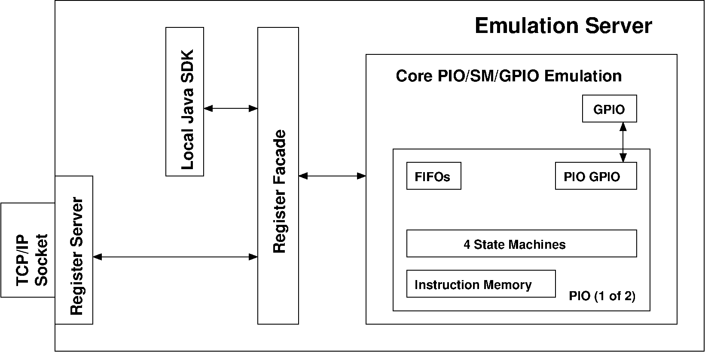
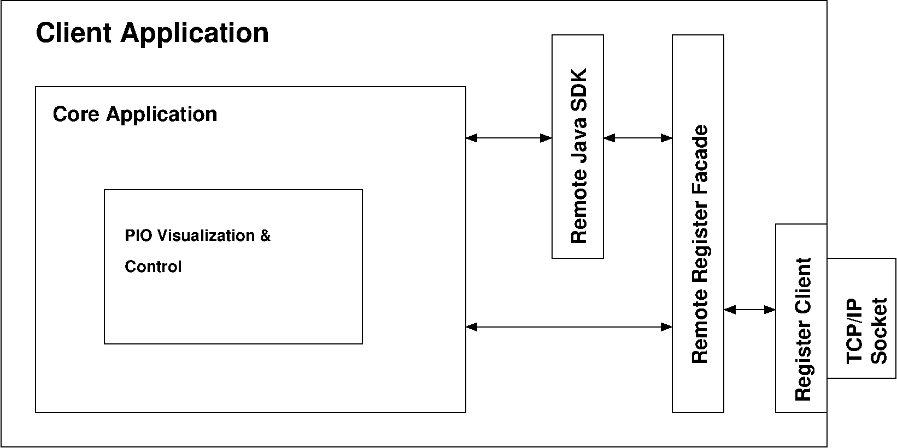
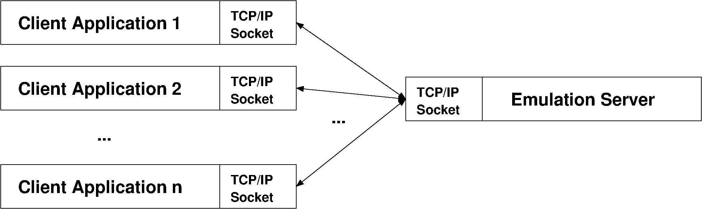

.. _section-top_architecture:

Architecture
============

The RP2040 PIO emulator has been designed to implement a client-server
architecture.

   Emulation Server

   The emulation server consists of the core emulator, the register
   facade, and the SDK implementation build upon the facade.

Emulator Core
-------------

The core emulator consists of all parts that are
relavant for emulating the complete PIO's logic, including:

* four instances of a state machine, including its complete internal
  state,
* instruction fetch and decoding,
* instruction execution including flow control, I/O, branching, and
  register access,
* interfacing with GPIO, FIFO, and DMA,
* IRQ handling.

Register Facade
---------------

The RP2040's PIO hardware provides memory-mapped I/O as the main
concept for interfacing with the RP2040's ARM cores.  The emulator
takes up the idea of a memory interface, implementing it as a
*register facade* that provides an address-based interface for
accessing all of the emulator's internal state by providing simple
``read()`` and ``write()`` operations.

Java SDK
--------

Similar to the Pico C SDK (but limited to those parts relevant for the
PIO), the emulator provides a Java SDK that builds up on the register
facade, just like the Pico C SDK builds up on read / write access of
the PIO's memory-mapped I/O.

Register Server
---------------

The register server is a TCP/IP based server that provides a very
simple protocol for exporting the functionality of the register facade
via a TCP/IP socket.  It mostly consists of a command for reading a
value from an emulator's address-based register, writing to an
emulator's adress-based register, and just a view more helper
functions.

   Client Application

   A client application implemented in any language (here assuming
   Java as an example) for the PIO server emulation consists of the
   core application that builds upon the SDK or directly upon the
   remote register facade, which are connected to the remote server
   via the register client.

Register Client
---------------

The register client is just another implementation of the above
*register facade*, that, however, does not directly communicate with a
local emulator instance.  Instead, the register client is connected to
a register server, and forwards all calls to this client's facade
implementation to the remote register server's backing register
facade.  In effect, the register client is the local stub
implementation for the remote register facade behind the register
server.

Remote Java SDK
---------------

Since our Java SDK solely builds upon the register facade, the SDK can
be backed either by a local register facade, or by a remote register
facade provided via the register client-server chain.

Client Applications
-------------------

The client / server architecture provides a solid base for a
sustainable ecosystem of client applications that create a pool of
development tools that just has begun to grow and will eventually
emerge into a fully grown environment for developing and debugging
RP2040 PIO programs.

For client applications that build on the Java SDK (such as the
Monitor, the TimingDiagram or the GPIO Oberserver application), there
is no appearant difference between a local and a remote facade
implementation.  Instead, these applications may share access onto the
same emulator instance, thus providing different and independent views
onto the same emulation.  Moreover, client applications can be written
in virtually any language, since they communicate via TCP/IP with the
emulation server rather than depending on a particular language
binding.

   Client-Server Architecture

   Multiple emulator client applications may connect to the same
   emulation server instance for visualizing or controlling different
   aspects of the emulation or use different approaches (e.g. GUI
   application vs. command-line interface).
