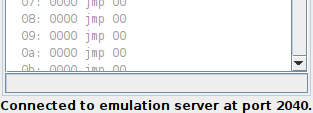
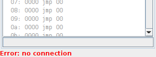

Client Applications
===================

Client applications connect to the Emulation Server for controlling
the emulation and observing the emulator's status.  Multiple clients
can concurrently interact with the server.  Consequently, a set of
parallel runnable tools sharing the same emulator can be combined to
an individually tailored devlopment and debugging environment.

Currently, the following tools are available.

.. table:: Currently Available Client Applications
    :widths: 10 10 20 60

    +----------------------------------+--------------+------------------------------------+--------------------------------------+
    | Title                            | Jar File     | Description                        | Screenshot                           |
    +==================================+==============+====================================+======================================+
    | :ref:`section-top_monitor`       | rp2040pio\_  | Textual-based interpreter with a   | .. figure:: images/monitor-help.png  |
    |                                  | monitor.jar  | set of commands for command-line   |    :scale: 40%                       |
    |                                  |              | interaction with the emulator.     |                                      |
    +----------------------------------+--------------+------------------------------------+--------------------------------------+
    | :ref:`section-top_gpio-observer` | rp2040pio\_  | Realtime visualization of GPIO     | .. figure:: images/gpio-observer.png |
    |                                  | gpioobserver | pins status (level & direction).   |    :scale: 40%                       |
    |                                  | .jar         | of all of the 32 GPIO pads.        |                                      |
    +----------------------------------+--------------+------------------------------------+--------------------------------------+
    | :ref:`section-top_code-observer` | rp2040pio\_  | Realtime visualization of PIO      | .. figure:: images/code-observer.png |
    |                                  | codeobserver | instruction memory as interpreted  |    :scale: 40%                       |
    |                                  | .jar         | by a specific state machine, also  |                                      |
    |                                  |              | considering side-set configuration |                                      |
    |                                  |              | of the particular state machine.   |                                      |
    +----------------------------------+--------------+------------------------------------+--------------------------------------+
    | :ref:`section-top_fifo-observer` | rp2040pio\_  | Realtime visualization of a state  | .. figure:: images/fifo-observer.png |
    |                                  | fifoobserver | machine's contents of FIFO memory  |    :scale: 40%                       |
    |                                  | .jar         | and status.                        |                                      |
    +----------------------------------+--------------+------------------------------------+--------------------------------------+
    | :ref:`section-top_diagram`       | rp2040pio\_  | Tool for creating timing diagrams  | .. figure:: images/diagram.png       |
    |                                  | diagram.jar  | of PIO internal state, displayed   |    :scale: 40%                       |
    |                                  |              | as signals for debugging and       |                                      |
    |                                  |              | verification.                      |                                      |
    +----------------------------------+--------------+------------------------------------+--------------------------------------+

More client applications for monitoring even more of a state machine's
internal state such as its scratch registers X and Y or the IRQs
configuration and status are planned for future implementation.

Connection Status
-----------------

All graphical clients show a status line at the bottom that indicates
the connection status.  Under normal working conditions, it will show
a message like: ::

  Connected to emulation server at port 2040.

   Successfully Connected Client

   The message in the status line indicates that the client has
   succesfully connected to the server at the stated port.

If, for whatever reason, the connection to the emulation server gets
lost, an appropriate warning will be printed in the status line.

   Client with Lost Connection

   The message in the status line indicates that the client has lost
   the connection to the emulation server.  As soon as it successfully
   reconnects, the message will disappear.

If the connection got lost, the client will in regular intervals
automatically try to reconnect again, using the previously used
connection data.

Command-Line Options
--------------------

All clients accept at least the following options when executed from
the command-line: ::

   Options:

     -V, --version (default: off)
               display version information and exit
     -h, --help (default: off)
               display this help text and exit
     -p, --port=PORT (default: 2040)
               use PORT as server port number
     -r, --refresh=TIME (default: 1000)
               autorefresh after <TIME> millis or no autorefresh, if 0

Specific clients may support further options.  For displaying all
available command-line options of a specific clients, call the client
with the ``-h`` option.
