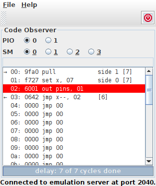
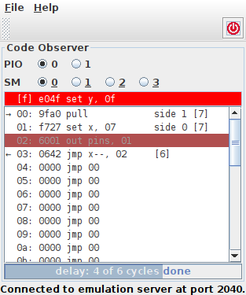

.. _section-top_code-observer:

Code Observer
=============

The *Code Observer* is useful for monitoring the progress of a PIO
program running on a state machine.  The functionality is roughly
comparable with the *unassemble* command of the monitor application.
However, while in the monitor application, one would need to actively
run the unassemble command over and over again, the code observer
application updates automatically in regular intervals, thus relieving
the user from actively polling for the status all the time.

The application is available as Jar file and can be executed from the
command line via ::

  java -jar rp2040pio_codeobserver.jar

with optional paramater ``-p`` to specify the server port to connect
to.  Again, like as for the server, the default port is ``2040``, if
not specified on the command line.

The code observer application displays the code as seen from the
selected PIO and state machine.  The instruction that the program
counter currently points to is highlighted in white color on red
background.  Usually (if you use the Code Observer together with the
monitor), the highlighted instruction is the next to be executed.

.. figure:: images/code-observer.png
   :scale: 80%
   :alt: Code Observer Application

   Code Observer Application

   The Code Observer is an example emulator client application that
   demonstrates how to visualize currently executed code.

Delay
-----

When executing an instruction with delay, the instruction is executed
and the program counter updates to the next memory location, but the
state machine will first insert delay cycles before executing the next
instruction.  The Code Observer will display the progress of delay
below the list of memory instructions and, since no instructions are
executed while delay in progress, the highlighted (i.e. next to be
executed) instruction will be grayed out.  A grayed out instruction
indicates that it is not yet ready for getting scheduled -- in this
case because delay cycles are still in progress.

   Delay Progress Display

   The Code Observer displays progress of delay and grays out the next
   to be executed instruction while delay is in progress.

When all delay cycles have been passed, the highlighted instruction is
displayed again in white text color on red background.

   Delay Completed

   When all delay cycles have passed, the next-to-be-executed
   instruction is again displayed as active.

Forced & EXEC'd Instructions
----------------------------

Pending forced and EXEC'd instructions are shown in an additional
separate line atop the scrollable list of memory instructions.  This
line is empty unless either a forced or an EXEC'd instruction is
awaiting execution.  To distinguish them, a forced instruction is
displayed with prefix ``[f]``, while an EXEC'd instruction is
displayed with prefix ``[x]``.  If both, a forced and an EXEC'd
instruction are awaiting execution, the forced instruction is shown,
since the state machine will execute it first.  Only after that, the
state machine will execute the EXEC'd instruction which will be
displayed as soon as the state machines starts executing the forced
instruction.

   Forced & EXEC'd Instructions

   Forced & EXEC'd instructions awaiting execution are displayed on a
   separate line atop the list of memory instructions.

Forced instructions are immediately executed regardless of delay
status.  Therefore, a pending forced instruction will be displayed as
active (i.e. not grayed out) even if delay cycles are still in
progress.  Following the RP2040 datasheet, she forced instruction's
delay (if any) is ignored.

Enable Status
---------------------------

If a state machine is disabled, it will not execute regular
instructions.  Consequently, when disabled, the list of memory
instructions is grayed out altogether.  Disabling a state machine does
not stop it to execute forced instructions.  Therefore, a forced
instruction is not grayed out, when a state machine is disabled.

   Disabled State Machine

   When a state machine is disabled, memory instructions are grayed
   out.  This policy does not apply on forced instructions, since they
   will be executed anyway.

Further Features
----------------

When necessary, the scroll pane automatically scrolls
such that the highlighted line of code is visible in the scroll pane's
viewport.  Also, wrap and wrap target locations are shown.

The Code Observer is, as the name already suggests, implemented as a
read-only client, at least as of now.  That is, it uses the emulation
server only for read-access of RP2040 registers, but does not do any
write access.  As such, the this client does not compete with any
other clients.  In fact, other clients will not notice presence of
this client; it operation keeps transparent.

.. figure:: images/code-observer-trace.gif
   :scale: 80%
   :alt: Code Observer in Monitor Session

   Code Observer in Monitor Session

   The code observer application can be highly useful in combination
   with the monitor application when tracing PIO programs.
