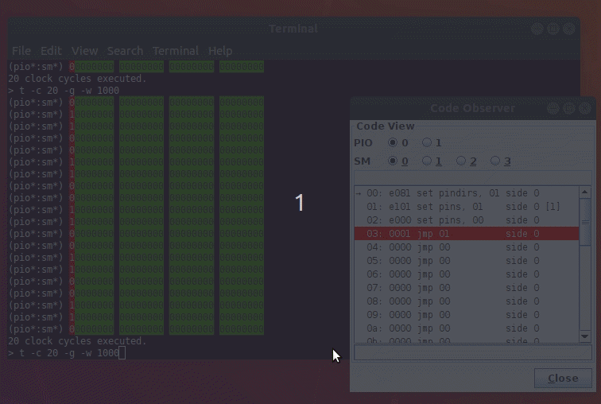

.. _section-top_code-observer:

Code Observer
=============

The *Code Observer* is useful for monitoring the progress of a PIO
program running on a state machine.  The functionality is roughly
comparable with the *unassemble* command of the monitor application.
However, while in the monitor application, one would need to actively
run the unassemble command over and over again, the code observer
application updates automatically in regular intervals, thus relieving
the user from actively polling for the status all the time.

The application is available as Jar file and can be executed from the
command line via ::

  java -jar rp2040pio_codeobserver.jar

with optional paramater ``-p`` to specify the server port to connect
to.  Again, like as for the server, the default port is ``2040``, if
not specified on the command line.

The code observer application displays the code as seen from the
selected PIO and state machine.  The currently executed instruction
(more precise: the code that the program counter currently points to)
is highlighted in white color on red background.  When necessary, the
scroll pane automatically scrolls such that the highlighted line of
code is visible in the scroll pane's viewport.  Also, wrap and wrap
target locations are shown.

.. figure:: images/code-observer.png
   :scale: 80%
   :alt: Code Observer Application

   Code Observer Application

   The Code Observer is an example emulator client application that
   demonstrates how to visualize currently executed code.

The Code Observer is, as the name already suggests, implemented as a
read-only client, at least as of now.  That is, it uses the emulation
server only for read-access of RP2040 registers, but does not do any
write access.  As such, the this client does not compete with any
other clients.  In fact, other clients will not notice presence of
this client; it operation keeps transparent.

   Code Observer in Monitor Session

   The code observer application can be highly useful in combination
   with the monitor application when tracing PIO programs.
