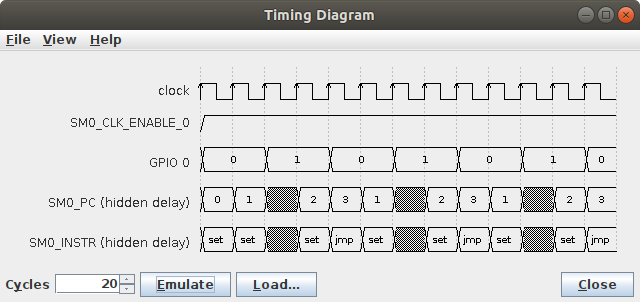
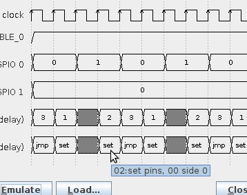
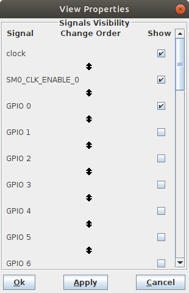
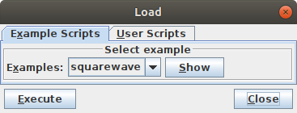
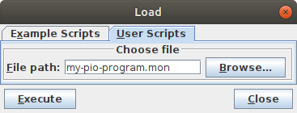

Timing Diagrams
===============

The TimingDiagram client application is used to create timing diagrams
from a run of a PIO program.  Given a set of signals to observe, the
application lets the emulator run a number of clock cycles (starting
from whatever current internal status of the emulator).  After each
cycle, the application records the updated states of all visualized
signals, until all all cycles have been performed.  Finally, it
renders the corresponding timing diagram from the recorded data.

   TimingDiagram Application

   The TimingDiagram application triggers the emulator to execute a
   number of cycles, starting from whatever state, records updated
   data for all visualized signals, and finally renders the diagram.

For specific signal types such as PIO instructions, more detailed
information, that does not fit into the narrow cells of the digram, is
instead displayed with tooltips.

   TimingDiagram Tooltips Display

   More detailed information is displayed with tooltips.

Via the *View* → *Properties…* dialog, the set of shown signals can be
selected and deselected, and the order can be changed.

   Visibility Control of Signals

   Visibility of signals can be individually turned on or off.  The
   order of display ca be changed.

Via the *File* → *Load…* dialog, a monitor script may be executed in
order to set up the emulator by loading a PIO program into a PIO's
instruction memory and configuring the emulator for executing it, such
as properly setting up the state machines' side-set for execution of
that program.  Some built-in example scripts are provided, but you can
also write your own user-specific monitor scripts for execution for
setting up the emulator.

.. table:: Execute Built-in or User Monitor Script for Emulation Setup
   :align: center

   +--------+--------+
   | |run1| | |run2| |
   +--------+--------+

Diagram export, e.g. as PDF, SVG or PNG file, is not yet implemented,
but will be added in the future.

The available set of displayable signals is currently limited and
hard-wired.  A freely configurable way to visualize the contents of an
arbitrary one of the emulator's set of registers will be added in the
future.
