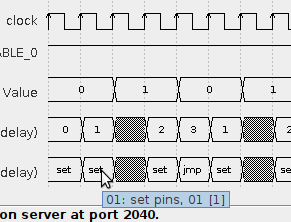

.. _section-top_diagram:

Diagram Creator
===============

The Diagram Creator client application is used to create timing
diagrams from a run of a PIO program.  Given a set of signals to
observe, the application lets the emulator run a number of clock
cycles (starting from whatever current internal status of the
emulator).  After each cycle, the application records the new values
of all of the currently displayed signals, until the number of desired
cycles has been completed.  Finally, it renders the corresponding
timing diagram from the recorded data.

Just like all other client applications, Diagram Creator is available
as Jar file and can be executed from the command line via::

  java -jar rp2040pio_diagram.jar

with optional paramater ``-p`` to specify the server port to connect
to.  Again, like as for the server, the default port is ``2040``, if
not specified on the command line.

.. figure:: images/diagram.png
   :scale: 80%
   :alt: Diagram Creator Application

   Diagram Creator Application

   The Diagram Creator application triggers the emulator to execute a
   number of cycles, starting from whatever state, records updated
   data for all visualized signals, and finally renders the diagram.

Recording
---------

Clock cycles to be recorded for the diagram view are triggered by
selecting a number of cycles and then pressing the ``Cycle`` button
|cycle_button_ref|.  Note that the Diagram Creator intentionally
only records data when clock cycles are triggered explicitly from
within the Diagram Creator.  It does *not* record clock cycles that
are triggered elsewhere, e.g. by the ``trace`` command from within a
Monitor instance.  The rationale behind this design is as follows:

* The Diagram Creator requires time to process signal data while
  recording, and thus might miss clock cycles, if it would try to keep
  up with clock cycles arriving too fast.  As a result, gaps would
  result in the recorded data, or the diagram could be even completely
  messed up (e.g. with data erroneously mapped to a wrong clock
  cycle).
* When detecting a gap in the emulator's wallclock during recording,
  the Diagram Creator will clear the view and start from scratch,
  since a detected gap in time usually means that recording a new
  diagram has started.  Assuming the Diagram Creator would react to
  externally triggered cycles, this behavior would imply that
  triggering a clock cycle from e.g. within a Monitor could
  accidentally clear the diagram view.

To avoid these flaws, the Diagram Creator only records clock cycles
that are triggered from within itself.  More cycles may be appended to
the currently displayed diagram just by running some more cycles,
provided that there is no gap detected.  If a gap is detected
(e.g. from executing the ``trace`` command in a Monitor instance
between the two emulation runs), the diagram view will be
automatically cleared before continuing with the next cycles.

To manually clear the diagram view, press the ``Clear`` button
|trash_button_ref|.  Clearing the diagram view will also drop all data
that has been recorded so far.

Rendering
---------

For specific signal types such as PIO instructions, more detailed
information, that does not fit into the narrow cells of the digram, is
instead displayed with tooltips.

   Diagram Tooltips Display

   More detailed information is displayed with tooltips.

Via the *View* → *Properties…* dialog, the set of shown signals can be
selected and deselected, and the order can be changed.

.. figure:: images/diagram-signals-visibility.png
   :scale: 80%
   :alt: Visibility Control of Signals

   Visibility Control of Signals

   Visibility of signals can be individually turned on or off.  The
   order of display can be changed.

.. warning::

   The signal view properties dialog is subject to change.  Currently,
   the available set of displayable signals is still limited and
   hard-wired.  As of now, only visibility and display order of this
   fixed set of signals can be configured.  This status quo is going
   to be replaced by a much more generic and freely configurable way
   to select register bits from the register facade and configure a
   renderer (out of a set of predefined renders) to apply on the
   selected bits.

Use the ``Zoom`` slider to adjust horizontal zoom, i.e. the time
scale, as it fits best for your needs.  If the diagram grows large,
scrollbars will appear such that you can select what section of the
diagram you will view.

.. note::

   Diagram export, e.g. as PDF, SVG or PNG file, is not yet
   implemented, but will be added some time in the future.

Setup
-----

Via the *File* → *Load…* dialog, a monitor script may be executed in
order to set up the emulator by loading a PIO program into a PIO's
instruction memory and configuring the emulator for executing it, such
as properly setting up the state machines' side-set for execution of
that program.  Some built-in example scripts are provided, but you can
also write your own user-specific monitor scripts for execution for
setting up the emulator.

.. |run1| image:: images/diagram-run-built-in-script.png
    :scale: 80%

.. table:: Execute Built-in or User Monitor Script for Emulation Setup
   :align: center

   +--------+--------+
   | |run1| | |run2| |
   +--------+--------+
