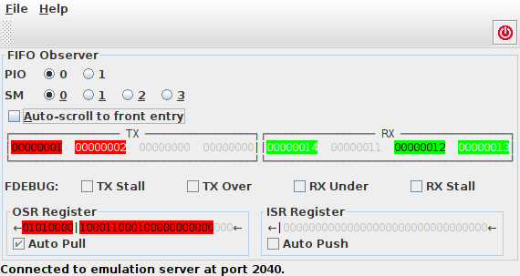
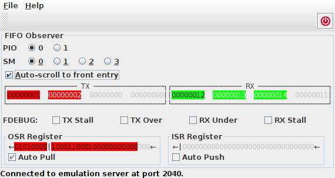
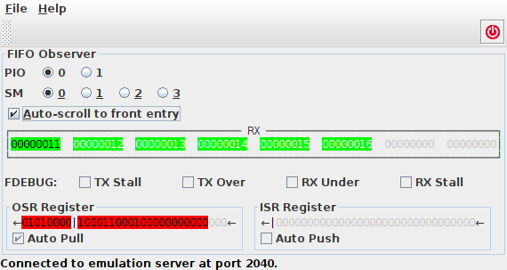

.. _section-top_fifo-observer:

FIFO Observer
=============

The *FIFO Observer* is useful for monitoring the status of a state
machine's FIFO.  The contents of the FIFO can also be displayed in the
monitor application with the command ``fifo``.  However, similar to
the other observers, while in the monitor application, one would need
to actively run the ``fifo`` command over and over again, the FIFO
observer application updates automatically in regular intervals, thus
relieving the user from actively polling for the status all the time.

The application is available as Jar file and can be executed from the
command line via ::

  java -jar rp2040pio_fifoobserver.jar

with optional paramater ``-p`` to specify the server port to connect
to.  Again, like as for the server, the default port is ``2040``, if
not specified on the command line.

Basic Operation
---------------

For a selected state machine of a selected PIO, the FIFO observer
application displays the FIFO's full memory contents as an array of 8
words, by default split into 4 words for the ``TX FIFO``, and another
4 words for the ``RX FIFO``.  Remember that the ``TX FIFO`` is used
for letting the CPU cores transmit data to the PIO, while the ``RX
FIFO`` is used for receiving data from the PIO and making it
accessible for the CPU cores.

For enqueueing and dequeueing data, you can

* execute or trace a PIO program that executes ``PUSH`` or ``PULL``
  commands or ``IN`` or ``OUT`` commands with activated automatic push
  or pull, respectively;
* manually run the monitor ``fifo`` to modify a FIFO (see
  Sect. :ref:`fifo <fifo-command-label>` for details),
* write a monitor script that pushes or pulls data at some specific
  point of time (see Sect. :ref:`section-top_io` for details),
* or, if available, run any other client application that allows for
  pushing or pulling data.

   FIFO Observer Application

   The FIFO Observer is an example emulator client application that
   demonstrates how to visualize all of the current contents of a
   state machine's FIFO memory.

FIFOs may have a variable number of currently enqueued entries.  That
is, some of the memory entries may be currently unused.  Currently
unused entries are shown in gray text color on light gray background.
Entries that contribute to the currently enqueued data are shown with
colored background: red color for the TX FIFO and green color for the
RX FIFO.  People with red-green color defective vision may still
differentiate between both FIFOs, since the RX and TX areas of memory
are surrounded with a properly labelled border.

Autoscrolling
-------------

The FIFOs are internally organized as cyclic buffers.  That means,
there is a *read pointer* that points to the next the next word to be
enqueued, and a *write pointer* that points to the memory location
where the next word will be enqueued.  If a FIFO is full, i.e. if all
entries are currently used, there is no way to tell which of the
entries is the next one to be dequeued, if you do not know where the
read pointer currently points to.  Therefore, the next word to be read
is shown with *black* text color, while all other currently used
entries are displayed with *white* text color.

Still, the view of the cyclic buffer may be confusing, in particular,
when the currently used entries wrap around.  Therefore, there is the
display option *Auto-scroll to front entry*.  If activated, the FIFOs'
contents is rotated such that the entry printed with black text color
is aligned with the left-most word that is displayed.  Dequeuing an
entry will then, consequently, scroll all of a FIFOs entries one
position to the left.

   FIFO Observer Autoscroll Display Option

   When the autoscroll display option is activated, the FIFO contents
   will be rotated such that the next-to-be-dequeued entry will be
   shown as the left-most entry.

Joining
-------

If only either RX FIFO or TX FIFO is needed, this FIFO may acquire all
memory of the other FIFO -- a concept that is called *FIFO joining*.
Accordingly, the FIFO observer displays *either* both, TX FIFO or RX
FIFO with each of them holding up to 4 words of memory, *or* only a
joined TX FIFO or RX FIFO with 8 words of memory.

   FIFO Joining

   One of either RX FIFO or TX FIFO may join to claim all of the other
   FIFO's memory, such that the FIFO depth grows from 4 words to 8
   words.

Similar to pushing and pulling, for join control, one can

* manually execute the monitor command ``fifo`` with the ``--join`` or
  ``--unjoin`` option (see Sect. :ref:`fifo <fifo-command-label>` for
  details),
* execute a monitor script that performs joining or unjoining at specified points of time,
* or, if available, use any other client application that allows for
  joining or unjoining.
