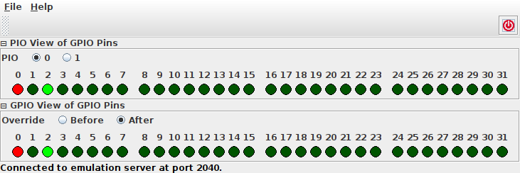

GPIO Observer
=============

The GPIO Observer serves as a simple example that illustrates how to
implement a small emulation client.  Its sole purpose is to display
the current status of all of the emulator's 32 GPIO pins.

The application is available as Jar file and can be executed from the
command line via ::

  java -jar rp2040pio_gpioobserver.jar

with optional paramater ``-p`` to specify the server port to connect
to.  Again, like as for the server, the default port is ``2040``, if
not specified on the command line.

For each GPIO pin, the application displays the pin's current pad
value and pin direction with an LED-like symbol.  If a GPIO pin is
programmed as input, it will be displayed as a green LED.  If a GPIO
pin is programmed as output, it will be displayed as a red LED.  If
the bit value of the pin is 1, it will be displayed with light color.
If it is 0, it will be displayed with dark color.

   GPIO Observer Application

   The GPIO Observer is an example emulator client application that
   demonstrates how to visualize internal state data of the emulator.

The display is regularly refreshed.  Currently, refresh is implemented
by active polling in regular time intervals with a default interval of
100ms.  The length of this interval can be overridden by passing the
``-r`` command-line option to the application: ::

  java -jar rp2040pio_gpioobserver.jar -r 1000

will, for example, set the refresh interval to 1000ms (that is, to a
second).

A future implementation may be based on a push model via client
notification for saving CPU resources, as compared to the current
polling.

The GPIO Observer is, as the name already suggests, implemented as a
read-only client.  That is, it uses the emulation server only for
read-access of RP2040 registers, but does not do any write access.  As
such, the this client does not compete with any other clients.  In
fact, other clients will not notice presence of this client; it
operation keeps transparent.
