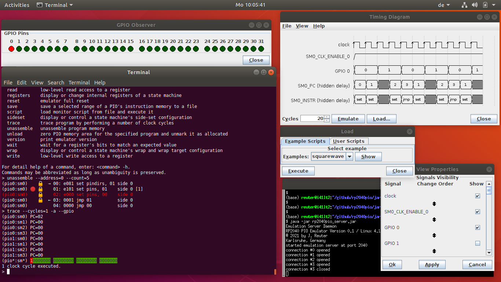

.. RP2040 PIO Emulator documentation master file, created by
   sphinx-quickstart on Sun Apr 11 04:45:41 2021.
   You can adapt this file completely to your liking, but it should at least
   contain the root `toctree` directive.

RP2040 PIO Emulator
===================

The RP2040 PIO emulator is a collection of software tools that
consists of

* a software emulation of the core PIO parts of the Raspberry Pi
  Foundation's RP2040 chip, and
* some client applications for controlling the emulator and observing
  and visualising its progress and internal state.

The software is intended as highly valuable collection of tools for
assistance in developing and debugging PIO programs for the RP2040.

Background
----------

In late January of 2021, the *Raspberry Pi Foundation* [RPF21a]_
announced their new *Raspberry Pi Pico* [RPF21b]_, that the foundation
designed by itself.

Besides two dual-core Arm Cortex-M0+ processor core, the RP2040 chip
also features two *programmable I/O blocks* (*PIO*) that are highly
interesting components, each including 4 so-called *state machines*
(*SM*), internal instruction memory, 8 FIFOs, and some more logic
components.  The state machines are, essentially, extremely simple but
fast microprocessors that run in parallel and independent from the
main CPU cores, and are specialized on bit processing for the
microcontroller's GPIO pins.  The concept of *side-sets* provides for
even more parallelism of bit manipulations, but also produces
side-effects that are challenging to handle.  Typical applications of
PIO programs are implementations of I/O protocols such as, for
example, I²C, SPI, UART, Manchester Serial Protocol, PWM, or even
WS2812.

Scope
-----

Developing PIO programs is extremely challenging due to the PIO's
highly specialized set of instructions oriented at bit-manipulation
and due to their parallel side-effects.  Even worse, there is no way
for debugging a PIO program on a real RP2040 chip.  Consequently, the
only way to debug a PIO program is to emulate all state machines'
behaviour and their interaction with external components.  This is
exactly, what the RP2040 PIO emulator does: It aims to mimick the
behaviour of all of the two PIOs' state machines as precise as
necessary to reproduce their logical functionality, such that PIO
programs can be debugged in the emulator, thus making it feasible to
develop programs for the PIO.

         GPIO Observer

   Server Console, Monitor Control Program, Timing Diagram and GPIO
   Observer at a Glance

   A typical development / debugging session with server console
   running in a standard terminal, client-side monitor for control and
   inspection, timing diagram for watching signals and GPIO Observer
   for watching current status of GPIO pins.

.. toctree::
   :maxdepth: 2
   :caption: Getting Started

   motivation
   overview
   download-and-compile

.. toctree::
   :maxdepth: 2
   :caption: Basic Blocks

   architecture
   emulation-server
   Monitor Client <monitor>

.. toctree::
   :maxdepth: 2
   :caption: Working With Client Applications

   diagram
   gpio-observer
   External Data <io>
   limitations

.. toctree::
   :maxdepth: 2
   :caption: Epilogue

   future-work
   references

.. toctree::
   :maxdepth: 2
   :caption: User Reference Documentation

   Monitor commands <monitor-commands>
   Socket API <socket-api>

.. toctree::
   :maxdepth: 1
   :caption: Register API Documentation

   pico-emu-registers
   pio-emu-registers
   pio-registers
   gpio-registers

Indices and tables
==================

* :ref:`genindex`
* :ref:`modindex`
* :ref:`search`
