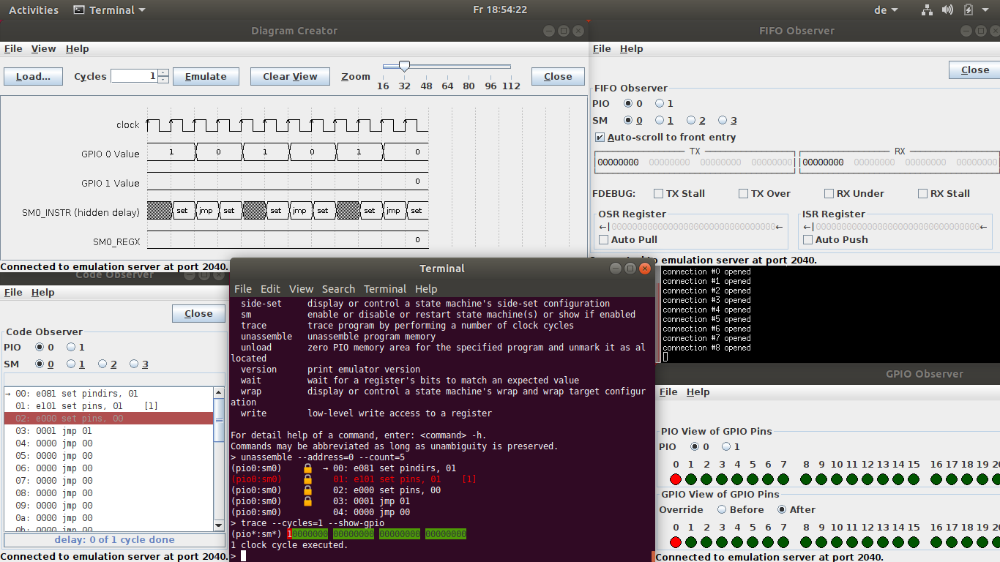

.. RP2040 PIO Emulator documentation master file, created by
   sphinx-quickstart on Sun Apr 11 04:45:41 2021.
   You can adapt this file completely to your liking, but it should at least
   contain the root `toctree` directive.

RP2040 PIO Emulator Documentation
=================================

The RP2040's two *programmable I/O blocks* (*PIO*) are highly
interesting components of the RP2040 chip, each including 4 *state
machines* (*SM*), that are effectively very simple, but fast
processors that run in parallel specialized for bit processing on the
GPIO pins.  The concept of *side-sets* provides for even more
parallelism of bit manipulations.

Unfortunately, writing PIO programs can be extremely hard.  Even
worse, the only way to debug a PIO program is to emulate a state
machine's behaviour and its interaction with the outer parts of its
world.  This is exactly, what the RP2040 PIO emulator does: It tries
to mimick the behaviour of all of the two PIO's state machines as
precise as necessary to reproduce its logical functionality such that
a PIO program can be debugged in the emulator, thus making developing
programs for the PIO much easier.

   Server Console, Monitor, Timing Diagram and GPIO Observer at a Glance

   A typical development / debugging session with server console
   running in a standard terminal, client-side monitor for control and
   inspection, timing diagram for watching signals and GPIO Observer
   for watching current status of GPIO pins.

.. toctree::
   :maxdepth: 2
   :caption: Getting Started:

   motivation
   download-and-compile

.. toctree::
   :maxdepth: 2
   :caption: Basic Blocks:

   overview
   architecture
   emulation-server
   monitor

.. toctree::
   :maxdepth: 2
   :caption: More Client Applications:

   diagram
   gpio-observer
   limitations

.. toctree::
   :maxdepth: 2
   :caption: Epilogue:

   future-work

Indices and tables
==================

* :ref:`genindex`
* :ref:`modindex`
* :ref:`search`
