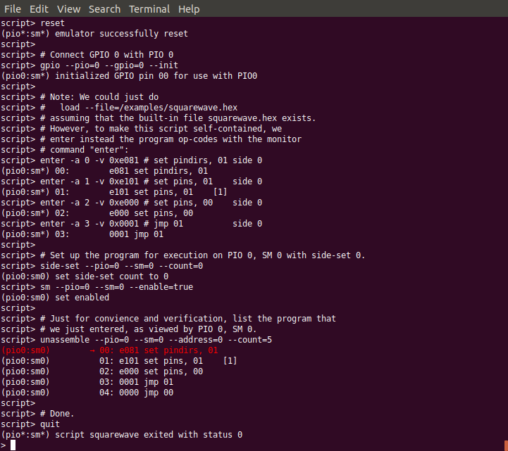
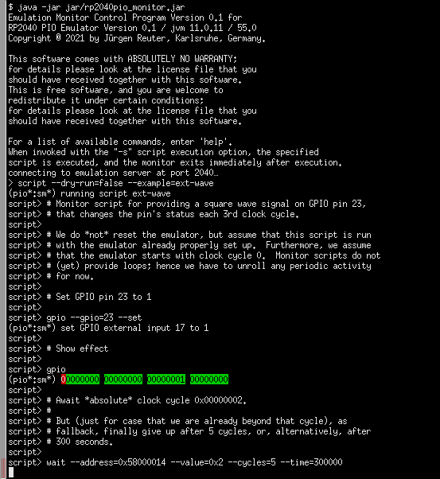

Interfacing With External Data
==============================

Usually, PIO programs are not purely self-contained suppliers, but,
other than the previusly demonstrated squarewave example, in reality
depend on I/O with an external source of input data.  The term
*external* here refers to the PIO's point of view.  That is, external
data may be provided by a source from outside of the RP2040 chip, but
also by a source from inside of the RP2040 chip, such as the RP2040's
main CPU cores.  For example, implementation of a UART TX or I²C ouput
will be fed by data words from the CPU cores that the PIO program will
serialize into a stream of bits to be ouput on a GPIO pin.  Or,
reversely, implementation of a UART RX or I²C input will be fed by
external data provided on the GPIO pins as input signal that the PIO
program will collect and forward to the CPU cores as data words.

In either case, for debugging a PIO program, beside the PIO program
itself, usually some source of external data (either from the CPU
cores or from outside of the RP2040 chip) needs to be supplied to be
fed into the PIOs.  Moreover, this process of providing a stream of
data must be synchronized with the PIO program.  For example, when
tracing a PIO program in single-step mode, the process of delivering
data to the PIO must delayed accordingly, at the same pace as the PIO
program is executed.

We basically already have all necessary tools to provide an external
data source that is kept in sync with the PIO program's progress: We
just write another monitor script that runs in parallel with the
monitor instance that we use for debugging our PIO program, and we use
the ``wait`` feature of our registers facade to synchronize both
scripts.

External Squarewave Generator
-----------------------------

To keep things simple, we create an external squarewave signal that is
provided on a GPIO pin and keep it in sync with our squarewave PIO
program.  However, to make it somewhat more interesting, we choose the
external squarewave to run at a speed of exactly 2/3 of that of the
squarewave produced by our example PIO program.  The following example
has no practical use other than demonstrating how to synchronize an
external data source with a PIO program that is being debugged.  The
example PIO program toggles the GPIO pin 0 each second cycle.  Hence,
our goal is to toggle the GPIO pin 23 each third cycle of the
emulation.

We assume that the emulator has been reset and starts counting with
clock cycle 0.  Therefore, initilization boils down to solely
initializing GPIO pin 23 for use with PIO 0. ::

  # Monitor script for providing a square wave signal on GPIO pin 23,
  # that changes the pin's status each 3rd clock cycle.

  # We do *not* reset the emulator, but assume that this script is run
  # with the emulator already properly set up.  Furthermore, we assume
  # that the emulator starts with clock cycle 0.  Monitor scripts do not
  # (yet) provide loops; hence we have to unroll any periodic activity
  # for now.

  # Connect GPIO pin 23 with PIO 0

  gpio --pio=0 --gpio=23 -i

Next, we initialize our GPIO pin, here for example with the pin's
value being set to a logical 1 state. ::

  # Set GPIO pin 23 to 1 for PIO0

  gpio --pio=0 --gpio=23 --set

For double-checking, we look at the result of our previous command. ::

  # Show effect

  gpio --pio=0

Next, we wait until clock cycle 0x00000002 is reached (assuming that
the emulator has just been reset and starts counting with clock cycle
0).  For the case that we are already beyond clock cycle 0x00000002,
we should, as fallback, provide a timeout, such that the script does
not get stuck forever at this wait condition.  Here, we specify *two*
timeout conditions.  Together with the actual wait condition, we then
have 3 conditions.  Whatever condition is met first will finish the
wait command:

* When seeing that the emulator's clock cycle counter has reached
  value 0x00000002, finish the wait command.
* After having waited for 300000 milliseconds (= 5 minutes), finish
  the wait command.
* After having waited the emulator to execute 5 clock cycles, finish
  the wait command.

::

  # Await *absolute* clock cycle 0x00000002.
  #
  # But (just for case that we are already beyond that cycle), as
  # fallback, finally give up after 5 cycles, or, alternatively, after
  # 300 seconds.

  wait --address=0x58000014 --value=0x2 --cycles=5 --time=300000

In a monitor session, we will run the monitor command ``trace`` that
executes instructions one by one, with this script for external signal
generation intercepting the emulator and also updating data.  In
general, this competing access will cause a race condition: The
monitor command ``trace``, when run with option ``-g``, will display
the GPIO pins' state at roughly the same time when this external
signal generation script will also update the GPIO pins.  In effect,
it is a coincidence whether the GPIO display will show the state
*before* or *after* the update performed by the external signal
generation script.  To avoid this situation, we defer signal
generation by another *half* cycle.  That is, we update the signal
immediately after cycle phase 0 has reached a stable state.  For this
purpose, we perform another ``wait`` command for waiting until stable
state of phase 0 by awaiting the trigger register
``MASTERCLK_TRIGGER_PHASE0`` to return a value of ``0x1`` that
indicates that stable state of phase 0 has been reached. ::

  # The PIO emulator performs instruction fetch & decode during clock
  # cycle phase 0, and instruction execution during cycle phase 1.
  # Therefore, the trace command of the monitor application displays the
  # GPIO state immediately after clock phase 1 has settled,
  # i.e. immediately after instruction execution has been completed.  To
  # avoid a race between the monitor showing the GPIO state after
  # completion of cycle phase 1 and this external signal supplying
  # script updating the GPIO state also immediately after completion of
  # cycle phase 1, scripts like this one are advised to update signal
  # state instead immediately after clock phase 0 has settled
  # (i.e. after PIO instruction fetch & decode, but before instruction
  # execution).  For that purpose, we do another wait for the next cycle
  # phase 0 to become settled.

  wait --address=0x5800000c --value=1 --cycles=0 --time=0

Now, we are synchronized with stable phase 0 after clock cycle
0x00000002 (unless a timeout occurred, in which case we also just
continue).  Since we have previously set GPIO pin 23 to 1, we now
reset it back to 0. ::

  # Now, clear GPIO pin 23 to 1 for PIO0

  gpio --pio=0 --gpio=23 --clear

For double-checking, we again look at the result of our previous
command. ::

  # Show effect

  gpio --pio=0

Now, that we have synchronized with phase 0 after clock cycle
0x00000002 (assuming that no timeout occurred on the last wait), there
is no more need to wait for an absoulte clock cycle value to show up.
Instead we just wait 3 clock cycles.  If a timeout has occurred on the
last wait, we are probably not synchronized with clock cycle
0x00000002, but don't mind and still go for a relative wait of 3
cycles.  How do we perform a wait for 3 clock cycles?  By using
choosing a wait condition that we are sure will never be satisfied,
and additionally define a timeout of 3 clock cycles.  For creating a
non-satisfiable condition, we can use the ``--mask`` option: By
masking the value to wait for with mask ``0``, effectively all bits
will be cleared such that the result value will always be ``0`` as
well.  If we now require this value to match a non-zero constant
(e.g. by specifying option ``--value=1``), we have created a condition
that never will be satisfied.  So, the wait condition will stop only
by running into a timeout, that we choose to occur after 3 clock
cyles. ::

  # Now wait again, but this time nor for an absolute amount of clock
  # cycles, but for 3 clock cycles to pass.  This can be done by
  # specifying a value match condition that surely will never be occur,
  # and additionally specify a timeout of 3 cycles, such that the wait
  # command will be for sure terminated after the timeout (rather than
  # by the value to be matched).  Specifically, option "--mask=0" will
  # mask out all bits, such that always a value of 0 will be received,
  # such that waiting for "--value=1" will never succeed, such that
  # finally the timeout will take effect after 3 cycles.  Also, turn off
  # the default milliseconds timeout of 100 seconds by setting it to 0.

  wait --address=0x58000014 --mask=0 --value=1 --cycles=3 --time=0

Once again, we await stable phase 0 of the following cycle to avoid
race condition with GPIO display while execution the ``trace``
command in the other monitor instance. ::

  wait --address=0x5800000c --value=1 --cycles=0 --time=0

Next, we toggle again out GPIO pin 23 bit and show its effect for
double-checking. ::

  # GPIO pin 23 := 1, and show effect.

  gpio --pio=0 --gpio=23 --set
  gpio --pio=0

And we wait for another 3 clock cycles (plus stable phase 0), toggle
the bit again and show it again for double-checking. ::

  # Wait again 3 cycles

  wait --address=0x58000014 --mask=0 --value=1 --cycles=3 --time=0
  wait --address=0x5800000c --value=1 --cycles=0 --time=0

  # GPIO pin 23 := 0, and show effect.

  gpio --pio=0 --gpio=23 --clear
  gpio --pio=0

And the same some more times. ::

  # Wait.

  wait --address=0x58000014 --mask=0 --value=1 --cycles=3 --time=0
  wait --address=0x5800000c --value=1 --cycles=0 --time=0

  # GPIO pin 23 := 1, and show effect.

  gpio --pio=0 --gpio=23 --set
  gpio --pio=0

  # And so on, for some more cycles...

  wait --address=0x58000014 --mask=0 --value=1 --cycles=3 --time=0
  wait --address=0x5800000c --value=1 --cycles=0 --time=0
  gpio --pio=0 --gpio=23 --clear
  gpio --pio=0
  wait --address=0x58000014 --mask=0 --value=1 --cycles=3 --time=0
  wait --address=0x5800000c --value=1 --cycles=0 --time=0
  gpio --pio=0 --gpio=23 --set
  gpio --pio=0

We can also make use of the monitor commands' abbreviated syntax. ::

  # And the same with abbreviated syntax.  Note that options "--cycles"
  # and "--time" can be completely dropped if we choose to use the
  # default values, which is ok, since we expect the wait to finish
  # within a very short period of time.

  wa -a 0x58000014 -m 0 -v 1 -c 3
  wa -a 0x5800000c -v 1
  g -p 0 -g 23 -c
  g -p 0
  wa -a 0x58000014 -m 0 -v 1 -c 3
  wa -a 0x5800000c -v 1
  g -p 0 -g 23 -s
  g -p 0

And the same some more times, this time without double-checking, since
we are now confident that our approach works fine. ::

  # And some more cycles, this time without showing each change.

  wa -a 0x58000014 -m 0 -v 1 -c 3
  wa -a 0x5800000c -v 1
  g -p 0 -g 23 -c
  wa -a 0x58000014 -m 0 -v 1 -c 3
  wa -a 0x5800000c -v 1
  g -p 0 -g 23 -s

Finally, at some point, we stop this process and quit the script. ::

  # And finally quit, when we are done.

  q

  # Done.

The complete external squarewave generator that we just have developed
line by line is also available as built-in example monitor script with
the name ``ext-wave``.  For viewing the complete script prior to
executing it, in the monitor, enter the command
``script --show=ext-wave``.

Running the External Signal Against the PIO Program
---------------------------------------------------

Now let us perform another example monitor session to see how to apply
our external signal while debugging a PIO program.

First, start a monitor session.  Execute the example squarewave PIO
pogram monitor script with the command ``script -d --example
squarewave`` (or, abbreviated, ``sc -d -e squarewave``).  The script
will start with resetting the emulator such that we are in a
well-defined state now, load the squarewave example PIO program into
PIO0, and set up SM0 of PIO0 for execution of the program.  The
initial ``reset`` in the script will also reset the clock cycle count
to start with value 0 upon execution of the next instruction.

   Prepare Monitor for Debugging Session

   Running the ``squarewave`` monitor script will initialize the
   emulator for debugging the squarewave example PIO program.

Next, enter ``trace`` to execute the first instruction of the program.
This step will setup pin directions, and check the result with the
command ``gpio -p 0`` to see the pins at PIO0.

   Setup GPIO Pin Directions

   Setup GPIO pin directions for use with the PIO program.

In another terminal window, we open a second instance of a monitor and
execute our ``ext-wave`` monitor script with the monitor command
``script -d -e ext-wave``.  The script will provide the external
signal on GPIO 23.  After startup, the script stops at the first
``wait`` command in expectation for the PIO program to arrive at clock
cycle 3.

   Start Monitor Script for Supplying External Signal

   Starting the ``ext-wave`` monitor script will start the process of
   supplying an external signal.

Now, in our first monitor instance, we enter the command ``trace -g -p
0 -w 1000 -c 30`` to let the emulator perform 30 clock cycles in order
to continue execution of our PIO program for a while.  Option ``-w
1000`` will insert a delay of 1 second between clock cycles, such we
can easier follow what happens.  Options ``-g`` and ``-p 0`` will show
us the GPIO pins for each cycle as seen by PIO0.

.. figure:: images/io-monitor-sync.gif
   :scale: 80%
   :alt: PIO Program Run With Synchronized External Signal Input

   PIO Program Run With Synchronized External Signal Input

   Executing 30 cycles of our PIO program ``squarewave`` while our
   ``ext-wave`` script provides external signal input.  One can see
   the perfect 2/3 time proportion between the toggling bit of GPIO 0
   (first, red column) that toggles every 2nd cycle, and the toggling
   bit of GPIO 23 (last green column in of the third group of columns)
   that toggles every 3nd cycle.

As we can see, the ``squarewave`` PIO program toggles GPIO pin 0 every
2nd cycle, while the synchronized external monitor script ``ext-wave``
toggles GPIO pin 23 every 3rd cycle.  In this example, there is, for
simplicity, no interaction between the external signal and the PIO
program.  But in a real-world use case, the PIO program could read in
the bit that is provided by the external signal.

Conclusion
----------

We have seen how to provide an external signal to the GPIO pins and
keep it in sync with a PIO program, even if the PIO program is
debugged in single-step mode, just by implementing a monitor script
that supplies the external data at the expected pace.

Similarly, we could write a monitor script that e.g. writes data into
the PIO's FIFOs, and sync this data supply monitor script with the PIO
program in the same way as we have done it for the external signal.
This way, we can simulate the processor cores to deliver data to the
PIO.

Yet, writing data supply monitor scripts can be tedious work.  Future
plans for the PIO emulator contain ideas for providing a client
application that assists in creating data supply monitor scripts,
e.g. by graphically editing an external signal and generating a proper
monitor script.

Alternatively, a yet-to-be-written emulator client application also
could directly interface the emulator via the socket API / register
facade for supplying external data to the PIO at the correct pace,
rather than generating and running monitor scripts.
