Monitor
=======

The Monitor application is the versatile core client, based on a text
interface, and a set of flexible commands that allow for query and
manipulation of all of the emulator's internal state that is
accessible through the register facade.  It provides commands for
low-level register access, but also strives to make available
high-level commands with functionality roughly comparable to those
parts of the Pico C SDK that are relevant for the PIO.

The monitor can be started in a terminal with the command::

  java -jar rp2040pio_monitor.jar

with optional paramater ``-p`` to specify the server port to connect
to.  Again, like as for the server, the default port is ``2040``, if
not specified on the command line.

The monitor supports a number of commands.  To see a list of available
command, just enter ``help``:

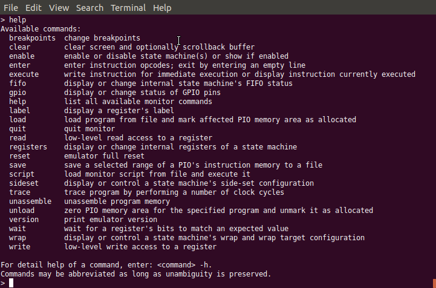

   Monitor Command ``help``

   The monitor provides the command help for listing all available
   commands.

For any of the listed commands, you can enter the name of that
command, followed by the option flag ``-h`` to show detailed help for
the specific command.  For example, the command help for the help
command looks as follows:

.. figure:: images/monitor-help-help.png
   :scale: 50 %
   :alt: Help for Monitor Command ``help``

   Help for Monitor Command ``help``

   The monitor command ``help`` lists all available monitor commands
   and provides only a single flag ``-h`` for showing the detailed
   help for this command.

The help information for each command shows the basic usage syntax for
the command, a short description of the command, optionally some more
detailed notes, and finally a list of all available options with
default value and a short description of the option.

Note: The syntax of the command options is subject to change.  The
overall goal is to simplify command syntax, were feasible, e.g. to be
able to write ``write 0x50200048 0`` instead of ``write -a
0x50200048 -v 0``.  However, since the commands implementation uses a
generic command line parser that currently does not support unnamed
options, first a major rewrite of the parser has to be taken before
the syntax can be updated.

Example Session
~~~~~~~~~~~~~~~

We give a short survey over a selected set of the monitor's feature
with an example session.

We start with resetting the emulator to initial, well-defined state.
In particular, reseting the emulator resets all of the RP2040 emulator's
registers to those reset values specified in the RP2040 datasheet.

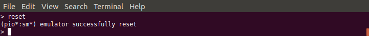

   Monitor Command ``reset``

   Full reset of the emulator.  In particular, all of the RP2040
   emulator's registers are reset to those reset values specified in
   the RP2040 datasheet.

In particular, the complete instruction memory of both PIOs will be
cleared, as we can verify with the ``unassemble`` command:

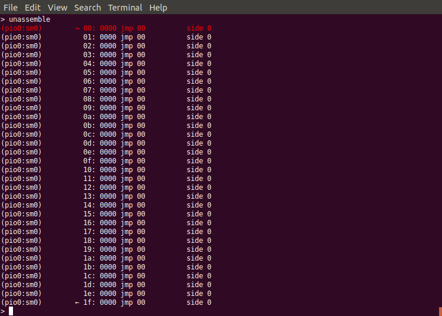

   Monitor Command ``unassemble`` After Full Reset

   After a full reset, the ``unassemble`` command will show that the
   instruction memory is cleared.

Note that the ``unassemble`` command shows the instruction memory for
the first of both PIOs, *PIO0*, and as viewed from the perspective of
state machine 0 (*SM0*).  The ``unassemble`` command provides options
to select a different PIO or SM, as you can find out by yourself by
querying the detailed command help with the ``unassemble -h`` command.
State machines 0, 1, 2 and 3 of a PIO share the same program memory,
but the appearance of instructions not only depends on the instruction
op-code, but also on settings of the particular state machine, such as
its *side-set*, as we will see later.  Therefore, specifying the state
machine is essential for correct display of the instruction.

The line printed in red color marks the current location of the
*program counter* (also known as *instruction pointer*), which is also
individual to each specific state machine and therefore also may
change, when viewing the same instruction memory listing from the
perspective of a different state machine.

Next, we load one of the built-in example PIO programs.  To get a list
of all built-in example PIO programs, we enter the command ``load
-l``:

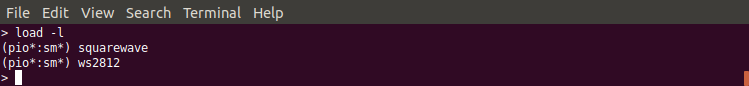

   Monitor Command ``load -l``

   Lists all available built-in example PIO programs.

We decide to load the ``squarewave`` example program:

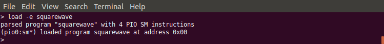

   Monitor Command for Loading the ``squarewave`` Example Program

   Loads the ``squarewave`` PIO example program.

We are told that the program consists of 4 instructions and was loaded
at address 0.

Let us now look again at the instruction memory:

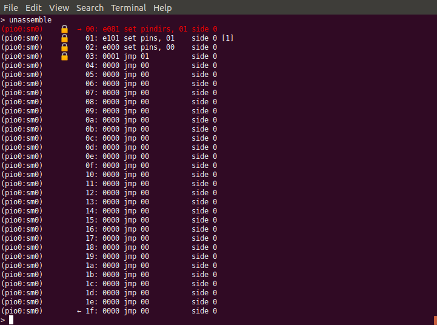

   Monitor Instruction Memory After Loading ``squarewave`` Program

   The lock symbol shows where the program has been loaded.

From the changed instructions, we can see that the program has been
loaded.  Also, the program area is marked as allocated, shown by the
lock symbol.  Management of memory allocation is *not* a feature of
the RP2040 itself, but a feature of the SDK to avoid accidental
overwriting of already loaded programs.  Remember, since the memory is
shared between all of the PIO's 4 state machines, and each state
machine capable of performing independently of the other 3 state
machines, it might be well reasonable to have 4 different programs
loaded at the same time, each executed by another state machine.  Note
that memory allocation management is a safety feature, but not a
security feature.  It helps avoiding accidental clash of different
programs when using the SDK's program load functions, but does not
prevent anyone with access to the RP2040's registers to deliberately
change op-codes anywhere within the instruction memory.

The little arrows on the first and last line of instruction memory
visualize the *wrap* and *wrap_target* feature for automatic control
flow at the end of a program, which is also specific to each
individual state machine.  Since the last instruction of our 4 word
program is a ``jmp`` (jump) command for jumping to address 1, this
program cares by itself for wrapping and therefore does not need to
make use of the program wrapping feature.

The program makes use of GPIO 0 as output.  Since many blocks of the
RP2040 can potentially output data to this pin, we have to tell that
our current PIO, PIO0, claims to make use of this pin.  For this
purpose, we execute the following monitor command:

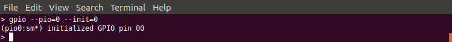

   Init GPIO Pin 0

   Init GPIO pin 0 for PIO0 to claim that PIO0 will be granted access
   to this pin.

If not initialized for this PIO, writing data bits to GPIO pin 0 would
have no effect outside of the PIO.

For this specific PIO program we do not need the wrap feature, and we
keep the *side-set* value unmodified.  Still we have to enable one of
the 4 state machines to actually run this program.  We choose state
machine 0 for this job.

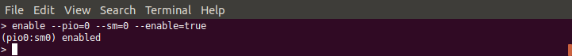

   Enable State Machine 0

   Enable state machine 0 for execution of our PIO program.

Now we are ready for tracing into the program.  For verification of
the GPIO's status, we use again the ``gpio`` command, but this time without passing any option.  It displays the current status of all of the 32 GPIO pins:

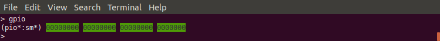

   GPIO Pins Status View

   Use the monitor command ``gpio`` without options for showing the
   status of all 32 GPIO pins.

For double check (if we forget to frequently check the status on the
monitor's command line), we open in parallel the GPIO Observer
application by invoking another JVM instance on the GPIO Observer Jar
file: ::

  java -jar rp2040pio_gpioobserver.jar

A window opens and shows that all GPIO pins in accordance with what
our monitor command ``gpio`` returned.

.. figure:: images/gpio-observer-monitor-0.png
   :scale: 50 %
   :alt: GPIO Pins Status View by GPIO Observer

   GPIO Pins Status View by GPIO Observer

   For double-check of our monitor session, we open the graphical GPIO
   Observer application.

Now, we are ready to trace into the PIO program.  We use the command
``trace`` that, by default, triggers a single clock cycle of the
emulator.  Since all instructions will execute in exactly one clock
cycle (unless a delay is explicitly specified), we will execute
exactly one instruction each time we enter the ``trace`` command.  We
add option ``-g`` to also observe any change on the GPIO pins.

The first PIO instruction, ``00: e081 set pindirs, 01 side 0``, will
change the pin direction of GPIO pin 1.  We can see the affect by the
color of the corresponding GPIO pin changing from green to red in both
views, in the monitor's textual GPIO display as well as in the
graphical application:

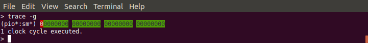

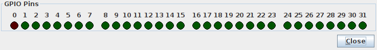

.. table:: Pin direction change for GPIO pin 0
   :align: center

   +-----------------+
   | |trace-a0|      |
   +-----------------+
   | |trace-a0-gpio| |
   +-----------------+

With the next cycle, PIO instruction ``01: e101 set pins, 01 side 0
[1]`` will change the GPIO's output value from ``0``to ``1``, followed
by a delay cycle.  Due to the one-cycle delay, the two cycles
essentially look identical.

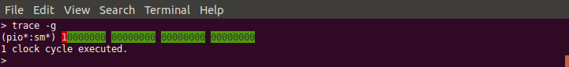

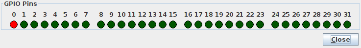

.. table:: Pin value change for GPIO pin from 0 to 1
   :align: center

   +-----------------+
   | |trace-a1|      |
   +-----------------+
   | |trace-a1-gpio| |
   +-----------------+

If we want to couble-check which instruction comes next, we can use
again the ``unassemble`` command to see the next instruction to be
executed (after any pending delay or inserted instruction).

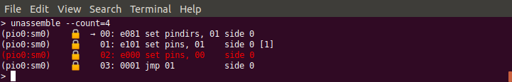

   View Next Instruction to Be Executed

   View which instruction is to be executed next, after any pending
   inserted instruction or pending delay.

The next instruction, ``02: e000 set pins, 00 side 0``, will set the
GPIO output value back to ``0``.

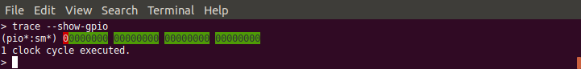

.. table:: Pin value change for GPIO pin from 1 back to 0
   :align: center

   +-----------------+
   | |trace-a2|      |
   +-----------------+
   | |trace-a2-gpio| |
   +-----------------+

Similar to the delay after the second instruction, the final jump
instruction ``03: 0001 jmp 01 side 0`` will have no further effect
other than jumping back to the instruction at address ``0x01``, thus
creating an overall infinite loop consisting of of 3 instructions and
1 delay cycle.

As overall result, GPIO pin 0 will regularly toggle its output value,
thus creating a squarewave, as the name of this example program
suggests.
