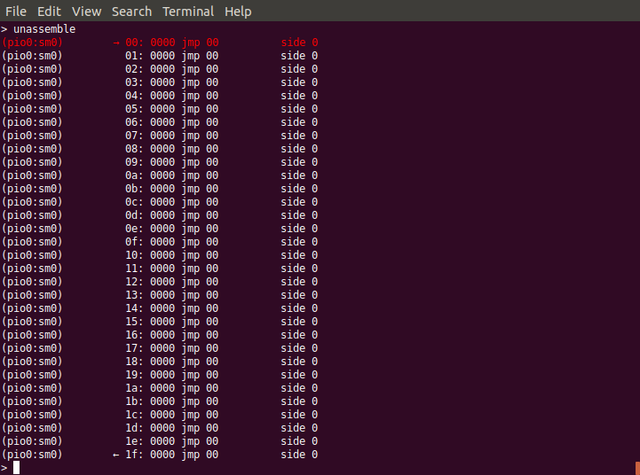
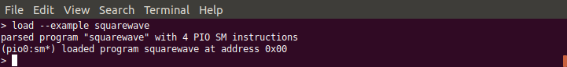
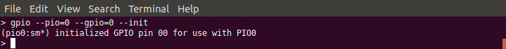
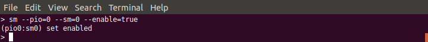
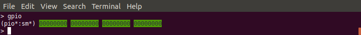
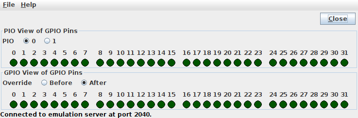
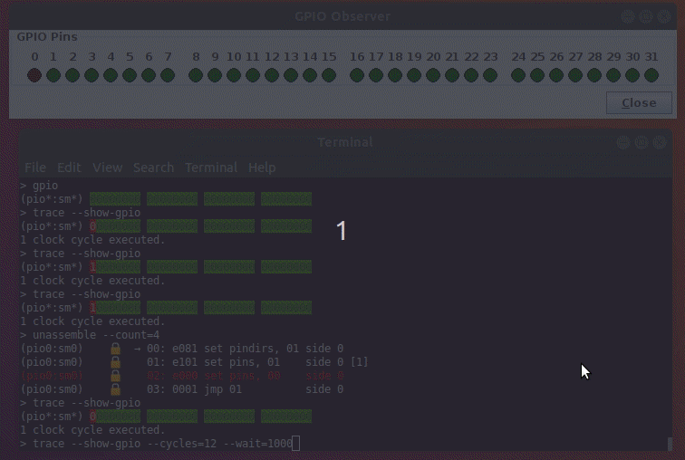
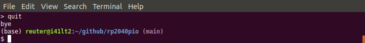

.. _section-top_monitor:

Monitor & Control Program
=========================

The Monitor & Control Program is a versatile core client application,
based on a textual command line interface, and a set of flexible
commands that allow for query and manipulation of all of the
emulator's internal state that is accessible through the register
facade.  It provides commands for low-level register access, but also
strives to make available high-level commands with functionality
roughly comparable to those parts of the Pico C SDK that are relevant
for the PIO.

Starting a Session
------------------

The monitor can be started in a terminal with the command::

  java -jar rp2040pio_monitor.jar

with optional paramater ``-p`` to specify the server port to connect
to.  Again, like as for the server, the default port is ``2040``, if
not specified on the command line.

The monitor supports a number of commands.  To see a list of available
command, just enter ``help``:

.. figure:: images/monitor-help.png
   :scale: 80%
   :alt: Monitor Command ``help``

   Monitor Command ``help``

   The monitor provides the command help for listing all available
   commands.

For any of the listed commands, you can enter the name of that
command, followed by the option flag ``--help`` (or, in the
abbreviated form, ``-h``) to show detailed help for the specific
command.  For example, the command help for the help command looks as
follows:

.. figure:: images/monitor-help-help.png
   :scale: 80%
   :alt: Help for Monitor Command ``help``

   Help for Monitor Command ``help``

   The monitor command ``help`` lists all available monitor commands
   and provides only a single flag ``--help`` for showing the detailed
   help for this command.

The help information for each command shows the basic usage syntax for
the command, a short description of the command, optionally some more
detailed notes, and finally a list of all available options with
default value and a short description of the option.

For most options, there is not only a long form (starting with ``--``,
e.g. ``--help``), but also an abbreviated short form (starting with a
single ``-`` and immediately followed by a single character,
e.g. ``-h``).  For clarity of this documentation, we usually prefer
the long form throughout all examples.  Advanced users, however, will
probably prefer the short form for minimizing key typing.

.. warning::

   The syntax of the command options is subject to change.  The
   overall goal is to simplify command syntax, were feasible, e.g. to
   be able to write ``write 0x50200048 0`` instead of
   ``write --address 0x50200048 --value 0``.  However, since the
   commands implementation uses a generic command line parser that
   currently does not support unnamed options, first a major rewrite
   of the parser has to be taken before the syntax can be updated.

Entering an empty line will just do no operation at all.  Empty lines
may be useful in monitor scripts for visually structuring command
sequences into separate sections.  For further details on command-line
parsing, such as escaping special characters, see the :ref:`Section on
command-line syntax <section-top_cmd-syntax>`.

Next, we give a short survey over a selected set of the monitor's
feature with an example session.

Resetting the Emulator
----------------------

We start with resetting the emulator to initial, well-defined state.
In particular, reseting the emulator resets all of the RP2040 emulator's
registers to those reset values specified in the RP2040 datasheet.

   Monitor Command ``reset``

   Full reset of the emulator.  In particular, all of the RP2040
   emulator's registers are reset to those reset values specified in
   the RP2040 datasheet.

In particular, the complete instruction memory of both PIOs will be
cleared, as we can verify with the ``unassemble`` command:

   Monitor Command ``unassemble`` After Full Reset

   After a full reset, the ``unassemble`` command will show that the
   instruction memory is cleared.

Note that the ``unassemble`` command by default shows the instruction
memory for the first of both PIOs, *PIO0*, and as viewed from the
perspective of state machine 0 (*SM0*).  The ``unassemble`` command
provides options to select a different PIO or SM, as you can find out
by yourself by querying the detailed command help with the
``unassemble --help`` command.  State machines 0, 1, 2 and 3 of a PIO
share the same program memory, but the appearance of instructions not
only depends on the instruction op-code, but also on settings of the
particular state machine, such as its *side-set*, as we will see
later.  Therefore, selecting a state machine is essential for correct
display of the instruction.

The line printed in red color marks the current location of the
*program counter* (also known as *instruction pointer*), which is also
individual to each specific state machine and therefore also may
change, when viewing the same instruction memory listing from the
perspective of a different state machine.

By default, the unassemble command displays all of the 32 memory
instructions.  If you want to see only an excerpt of the instruction
memory, use options ``--address`` and ``--count``.

Set Up a Program
----------------

Next, we load one of the built-in example PIO programs.  To get a list
of all built-in example PIO programs, we enter the command ``load
--list``:

   Monitor Command ``load --list``

   Lists all available built-in example PIO programs.

We decide to load the squarewave example program with the command
``load --example squarewave``:

   Monitor Command for Loading the ``squarewave`` Example Program

   Loads the squarewave PIO example program with the monitor command
   ``load --example squarewave``.

We are told that the program consists of 4 instructions and was loaded
at address 0.

Let us now look again at the instruction memory:

.. figure:: images/monitor-squarewave-loaded.png
   :scale: 80%
   :alt: Monitor Instruction Memory After Loading ``squarewave`` Program

   Monitor Instruction Memory After Loading ``squarewave`` Program

   The lock symbol shows where the program has been loaded.

From the changed instructions, we can see that the program has been
loaded.  Also, the program area is marked as allocated, shown by the
lock symbol.  Management of memory allocation is *not* a feature of
the RP2040 itself, but a feature of the SDK to avoid accidental
overwriting of already loaded programs.  Remember, since the memory is
shared between all of the PIO's 4 state machines, and each state
machine capable of performing independently of the other 3 state
machines, it might be well reasonable to have 4 different programs
loaded at the same time, each executed by another state machine.  Note
that memory allocation management is a safety feature, but not a
security feature.  It helps avoiding accidental clash of different
programs when using the SDK's program load functions, but does not
prevent anyone with access to the RP2040's registers to deliberately
change op-codes anywhere within the instruction memory.

The little arrows on the first and last line of instruction memory
visualize the *wrap* and *wrap_target* feature for automatic control
flow at the end of a program, which is also specific to each
individual state machine.  Since the last instruction of our 4 word
program is a ``jmp`` (jump) command for jumping to address 1, this
program cares by itself for wrapping and therefore does not need to
make use of the program wrapping feature.

The program makes use of GPIO 0 as output.  Since many blocks of the
RP2040 can potentially output data to this pin, we have to tell that
our current PIO, PIO0, claims to make use of this pin.  For this
purpose, we execute the following monitor command
``gpio --pio=0 --gpio=0 --init``.

   Init GPIO pin 0 for PIO0

   Init GPIO pin 0 for PIO0 to claim that PIO0 will be granted access
   to this pin.

If not initialized for this PIO, writing data bits to GPIO pin 0 would
have no effect outside of the PIO.

For this specific PIO program we do not need the wrap feature, and we
keep the *side-set* value unmodified.  Still we have to enable one of
the 4 state machines to actually run this program.  We choose state
machine 0 for this job with the command
``sm --pio=0 --sm=0 --enable=true``.

   Enable State Machine 0

   Enable state machine 0 for execution of our PIO program.

.. note::

   Entering (or loading in) a PIO program and setting it properly up
   can be tedious and error-prone work.  The monitor features a very
   simple form of scripting: monitor commands can be collected in
   script file (typically using the file name extension ``.mon``) for
   execution with the ``script`` command.  In fact, there is a
   built-in example script that can be run with the command
   ``script --dry-run=false --example squarewave``, that effectively
   executes all of the previous commands executed so far in this
   section.  For details of the script command, enter ``script
   --help`` to see detail help on this command.

Step-by-Step Tracing
--------------------

Now we are ready for tracing into the program.  For verification of
the GPIO's status, we use again the ``gpio`` command, but this time without passing any option.  It displays the current status of all of the 32 GPIO pins:

   GPIO Pins Status View

   Use the monitor command ``gpio`` without options for showing the
   status of all 32 GPIO pins.

Since it is tedious to frequently check the status on the monitor's
command line, we may open in parallel the
:ref:`section-top_gpio-observer` application by invoking another JVM
instance on the GPIO Observer Jar file: ::

  java -jar rp2040pio_gpioobserver.jar

A window opens and shows that all GPIO pins in accordance with what
our monitor command ``gpio`` returned.

   GPIO Pins Status View by GPIO Observer

   Running the GPIO Observer in parallel to the monitor is much less
   tedious than always checking for the status on the command-line.

On the other hand, showing the GPIO status in the monitor on the
command-line has the advantage that you can track the history by
scrolling back in the terminal window, while the GPIO Observer
displays the current status only, but has the advantage of
automatically updating its display.  Therefore, you may want to use
both ways of GPIO status display in parallel.

.. note::

   The two PIOs both can access all GPIO pins by mapping GPIO pins
   individually to either PIO0 or PIO1.  Therefore, there is a view of
   GPIO pins as seen by a specific PIO, but also the global view of
   GPIO pins as seen from outside of the chip.  Since in our examples,
   we always use only a single PIO, both views are effectively
   identical.  Therefore, for clearness we only show one of both views
   in the following examples.

Now, we are ready to trace into the PIO program.  We use the command
``trace`` that, by default, triggers a single clock cycle of the
emulator.  Since all instructions will execute in exactly one clock
cycle (unless a delay is explicitly specified), we will execute
exactly one instruction each time we enter the ``trace`` command.  We
add option ``--show-gpio`` to also observe any change on the global
view of GPIO pins.  Note that we also could use option
``--show-local-gpio`` together with option ``--pio=0`` for showing
PIO0's view of GPIO pins, giving the same result.

The first PIO instruction, ``00: e081 set pindirs, 01 side 0``, will
change the pin direction of GPIO pin 1.  We can see the affect by the
color of the corresponding GPIO pin changing from green to red in both
views, in the monitor's textual GPIO display as well as in the
graphical application:

.. |trace-a0| image:: images/monitor-trace-a0.png
    :scale: 80%

.. table:: Pin direction change for GPIO pin 0
   :align: center

   +-----------------+
   | |trace-a0|      |
   +-----------------+
   | |trace-a0-gpio| |
   +-----------------+

With the next cycle, PIO instruction ``01: e101 set pins, 01 side 0
[1]`` will change the GPIO's output value from ``0`` to ``1``,
followed by a delay cycle.  Due to the one-cycle delay, the two cycles
essentially look identical.

.. |trace-a1| image:: images/monitor-trace-a1.png
    :scale: 80%

.. table:: Pin value change for GPIO pin from 0 to 1
   :align: center

   +-----------------+
   | |trace-a1|      |
   +-----------------+
   | |trace-a1-gpio| |
   +-----------------+

If we want to couble-check which instruction comes next, we can use
again the unassemble command to see the next instruction to be
executed (after any pending delay or inserted instruction).  We limit
the output to only the first four words of instruction memory with the
optional count argument, thus entering ``unassemble --count=4``.

.. figure:: images/monitor-trace-a2-pc.png
   :scale: 80%
   :alt: View Next Instruction to Be Executed

   View Next Instruction to Be Executed

   View which instruction is to be executed next, after any pending
   inserted instruction or pending delay.

The next instruction, ``02: e000 set pins, 00 side 0``, will set the
GPIO output value back to ``0``.

.. |trace-a2-gpio| image:: images/monitor-trace-a2-gpio.png
    :scale: 80%

.. table:: Pin value change for GPIO pin from 1 back to 0
   :align: center

   +-----------------+
   | |trace-a2|      |
   +-----------------+
   | |trace-a2-gpio| |
   +-----------------+

Similar to the delay after the second instruction, the final jump
instruction ``03: 0001 jmp 01 side 0`` will have no further effect
other than jumping back to the instruction at address ``0x01``, thus
creating an overall infinite loop consisting of of 3 instructions and
1 delay cycle.

As overall result, GPIO pin 0 will regularly toggle its output value,
thus creating a squarewave, as the name of this example program
suggests.

Multi-Step Tracing
------------------

For a better view of the PIO programs dynamical behavior, we may trace
multiple cycles in equidistant intervals of time.  Let us choose to
perform 20 clock cycles at once, with a pause of 1 second (=1000ms)
between each cycle and showing the GPIO pins' status after execution
of each cycle, using the command
``trace --show-gpio --cycles=12 --wait=1000``.

   View PIO Program Dynamic Behavior

   View the PIO program's dynamic behavior by watching how the GPIO
   pins are updated over time.

The trace command, now regularly executing clock cycle by clock cycle,
illustrates how GPIO pin 0 periodically toggles its value.  Display of
the GPIO pins status as displayed by the monitor trace command and the
corresponding display of GPIO pins by the GPIO observer are in sync,
though with possibly a small perceivable delay caused by the
communication chain *monitor client application* → *emulation server*
→ *GPIO observer client*.

Ending a Session
----------------

To ordinarily end a monitor session, just enter the command ``quit``.

   Quit Monitor

   Call command ``quit`` to ordinarily exit from the monitor.

Note, that ending the monitor session does not stop the emulator
server.  You can resume work with the emulator, if still running, at
any time with starting a new monitor session.  Any program that has
previously been loaded will still be visible.  However, you can always
perform the monitor ``reset`` command to reset the emulation server if
you want to restart a new session from scratch.
