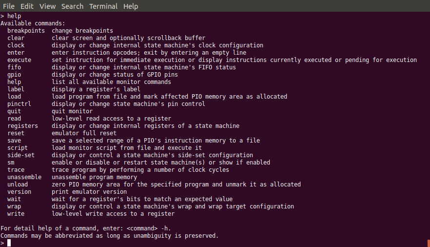
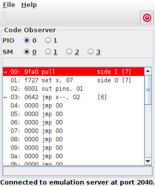
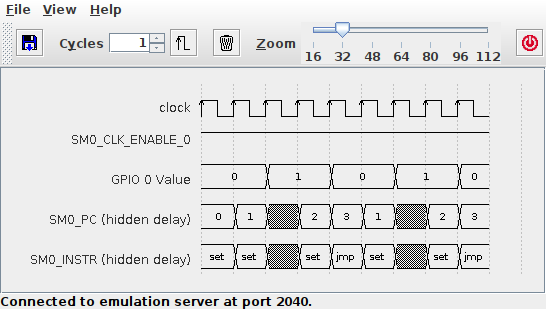

Overview
========

The typical overall flow of work with the RP2020 PIO Emulator may
roughly follow the subsequent pattern.

Start Emulation Server
----------------------

In a typical development / debugging session, one will begin with
:ref:`starting a server instance.<section-top_emulation-server>` ::

   $ java -jar ../rp2040pio/jar/rp2040pio_server.jar
   Emulation Server Daemon
   RP2040 PIO Emulator Version 0.1 / Linux 4.15.0-139-generic
   © 2021 by J. Reuter
   Karlsruhe, Germany
   started emulation server at port 2040

Start Monitor Session
---------------------

Next, a :ref:`monitor instance<section-top_monitor>` can be used to
load, modify, trace and save PIO programs and inspect the current
state of all state machines or any other parts of the emulator. ::

  java -jar rp2040pio_monitor.jar

   List of Available Monitor Commands

   The monitor provides a comprehensive set of useful low-level as
   well as high-level commands.

Start the GPIO Observer
-----------------------

For continuously observing the state of registers, entering register
queries over and over again on the monitor's command line is tedious
work.  Therefore, there are specialized client applications such as
for example the :ref:`GPIO Observer<section-top_gpio-observer>`, that
continuously visualizes the current state of GPIO pins without further
need for interaction. ::

  java -jar rp2040pio_gpioobserver.jar

Additional visual tools are highly useful add-ons that can be run in
parallel with the monitor.

.. figure:: images/gpio-observer.png
   :scale: 80%
   :alt: GPIO Observer Application

   GPIO Observer Application

   The GPIO Observer visualizes all of the 32 GPIO pins' status (level
   and direction).

Start the Code Observer
-----------------------

For tracing programs, it may be useful to automatically see the PIO
program's progress as it proceeds through the code, using the
:ref:`Code Observer<section-top_code-observer>` client application. ::

  java -jar rp2040pio_codeobserver.jar

This tool is particularly useful in combination with the monitor
application's *trace* command to follow a PIO program's control flow.

   Code Observer Application

   The Code Observer visualizes a PIO program's progress in the
   instruction memory for a specific state machine.

Start the FIFO Observer
-----------------------

For observing the FIFO contents of any of the two PIO's state
machines, use the :ref:`FIFO Observer<section-top_fifo-observer>`
client application. ::

  java -jar rp2040pio_fifoobserver.jar

This tool is particularly useful in combination with the monitor
application's *trace* command to follow a PIO program's effect on a
state machine's FIFOs.  The monitor also provides the command ``fifo``
for directly modifying a FIFO's contents and state of joining.

.. figure:: images/fifo-observer.png
   :scale: 80%
   :alt: FIFO Observer Application

   FIFO Observer Application

   The FIFO Observer visualizes a selected state machine's contents of
   its FIFOs.

Draw Timing Diagrams
--------------------

PIO programs are, after all, about processing digital, mostly binary,
signals.  Consequently, timing diagrams of resulting intermediate or
output signals are essential for developing, debugging, understanding
and working with PIO programs.  Therefore, timing diagrams are a
highly valuable tool not only for developing and debugging, but also
for documenting functionality and effect of PIO programs.  Like all
other client applications, :ref:`TimingDiagram<section-top_diagram>`
is ready to run as Jar file. ::

  java -jar rp2040pio_diagram.jar

The TimingDiagram client application connects to the RP2040 emulator,
and observes and records selected state variables of the emulator's
status while the emulator executes a PIO program.  All collected data
is visualized as a graphical diagram of signal values over time.

   TimingDiagram Application

   Signals to be visualized can be activated or deactivated, and their
   order from top to bottom can be freely changed.

Note that currently the set of available signals is still limited to a
small number of the most intersting emulator state variables.  A
near-future version of the timing diagram application will overcome
this restriction and support a lot more of signals -- virtually all of
the emulator's internal state variables.

Obtain a Tailored Environment
-----------------------------

The combination of these client applications (and, to be expected for
the future, still many more applications to emerge) allows for highly
individualized and customizable environemnts for developing and
debugging PIO programs.  The emulator's flexible client-server
architecture provides for a perfect and open ecosystem of client
applications -- also open for contributions even by third-party
developers.
